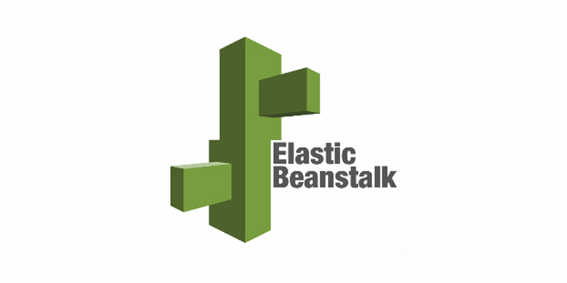

#### Introduction
Hi, my name is Yoni Pineda! Im a Data Science student at [Lambda School](https://lambdaschool.com/). I enjoy building REST API's to bring neat Machine-Learning features to Web and Mobile apps. Im experienced in computer vision, Natural Language Processing, Heroku and AWS deployment, Data Pipelines, Software Engineering, and managing teams.

#### Skills
<small>Tech Stack)</small>

- [Python](https://www.python.org/downloads/release/python-374/)
  

- [FastApi](https://fastapi.tiangolo.com/)
  

- [AWS ElasticBeanstalk](https://aws.amazon.com/elasticbeanstalk/)
  
